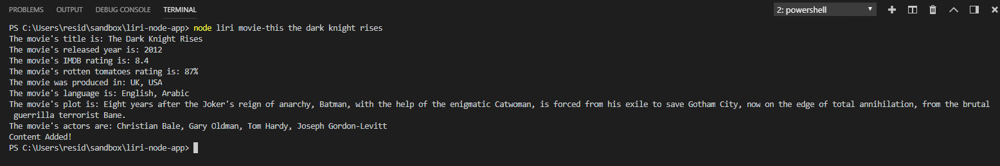

# liri-node-app

This is a node.js application that doesn't executes on the browser.
Download/clone the application so you can run it on your computer!

<a href="https://lugof.github.io/liri-node-app/">Link to Readme File</a>   
<a href="https://github.com/lugof/liri-node-app">Link to repository</a>   

## Liri-node-js application:

* This application is a CLI using 3 apis that will allow you to do the following:
    * Use bandsintown api to find information about upcoming artists concerts
    * Use spotify api to find information about specific songs
    * Use omdb api to find information about specific movies
    * Use a readmefile with one of the 3 previous commands in order to execute one of the 3 mentioned apis.

* It will also save every result on a log.txt file so you can always have access to your previous interactions with liri.

# Interacting with siri:
 * You need to specify your commands as follows:  `node "name of the js file" "command" "song,artist or movie to find".

    * The following are the available terminal commands to interact with liri:  
            `concert-this`  
            `spotify-this-song`  
            `movie-this`  
            `do-what-it-says`  
     * The spotify and movie this commands will show you a pre-determined result if you don't specify the artist search but you can also do your own search, please note the following terminal correct examples:  
            `node liri concert-this vance joy`  
            `node liri spotify-this-song aerials`  
            `node liri movie-this the dark knight rises`  

            
     * The last command "do-what-it-says" is already pre-determined so user doesn't make that input on terminal.

           * Examples on terminal:
            
          
          
          

   
## Video showing the application working:

 
https://drive.google.com/open?id=1E1A5vuY1vuz5U3BthXpF0SpNpiSkFqo3

# Creator:
* Francisco Gonzalez